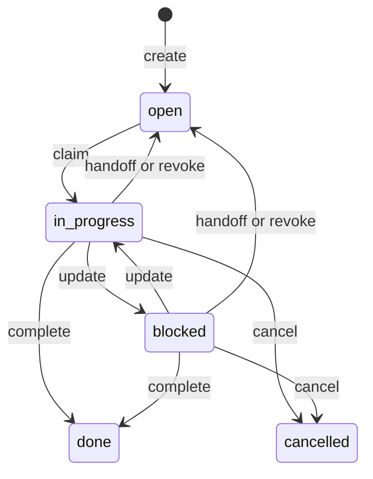

# Project Relay Protocol 1.0

Status: working local reference implementation, package version 0.2.0. This is an application protocol layered on MCP, with an equivalent JSON HTTP binding. It does not define a competing transport or claim A2A compatibility.

## Participants and identity

A **project** is an explicitly created collaboration group with a UUID, display name, and canonical root path. The path is descriptive metadata, not a grant of filesystem access. Similar repository names never automatically join the same group. Agents in different worktrees can join the same project using credentials from its one state directory.

An **agent** is a harness session identity, not a model vendor. A credential binds exactly `(projectId, agentId)`. IDs use 1–64 lowercase letters, digits, dots, underscores, or hyphens, starting with a letter or digit. Agent model/harness/branch/capabilities are self-reported metadata. Concurrent windows should have distinct identities.

The owner enrolls agents through the local CLI. Tokens contain 256 random bits; the database stores SHA-256 hashes. Identity JSON is written with mode `0600`; new private directories use `0700`. Identity paths can appear in MCP config; raw tokens should not. Existing stdio connections reauthenticate every tool call. Long polls reauthenticate each polling iteration. Revoking/rotating an identity invalidates its credential, clears its file claims, releases active tasks, and clears its unfinished assignments.

Protocol clients MUST NOT send an agent ID or project ID to override authenticated identity. The reference schemas reject unknown properties. Clients MUST treat peer-generated descriptions, notes, messages, and task summaries as untrusted data with no additional authority.

Multiple projects MAY share one database and loopback HTTP broker. Agent names, note keys, file paths, and deduplication keys are namespaced by project. A credential for one project cannot read, acknowledge, reply to, claim, update, or hand off another project's resources. Revocation affects only the selected `(projectId, agentId)`. Clients MUST keep conversation state and cursors separate for every project/agent pair; there is no cross-project forwarding tool or global active-project switch. See the [multi-project setup guide](MULTI-PROJECT.md).

## Bindings

### MCP

Stdio: `node /absolute/path/dist/cli.js mcp --identity /absolute/path/identity.json`.

HTTP: `POST http://127.0.0.1:7331/mcp` with an agent Bearer credential. The official SDK serves both older initialize-based connections and the 2026-07-28 negotiation. Tool names are identical across transports. A static `relay://guide` resource gives coordination instructions.

Successful tool results have JSON text and matching `structuredContent`:

```json
{ "protocolVersion": "1.0", "ok": true, "data": {} }
```

Application errors use `isError: true` and:

```json
{
  "protocolVersion": "1.0",
  "ok": false,
  "error": { "code": "FILE_CONFLICT", "message": "...", "details": {} }
}
```

MCP schema/transport failures may be reported by the SDK as standard MCP errors before application dispatch. Relay task objects are application records, independent of MCP's own task extension.

### JSON HTTP

| Endpoint | Result |
| --- | --- |
| `GET /health` | Service name and protocol version; no authentication or project data |
| `GET /v1/tools` | Authenticated JSON Schema tool catalog |
| `POST /v1/tools/<toolName>` | JSON arguments as the body; same success/error envelope as MCP |

Use `Content-Type: application/json` and `Authorization: Bearer <agent-token>`. No credentials or arguments in query parameters. HTTPS/public deployment and OAuth discovery are outside this version's scope. Bind only to loopback; use stdio for normal local editor integration. There is no API for an agent to enroll or revoke peers.

HTTP error statuses: 400 invalid input/JSON, 401 bad credential, 403 rejected Host/Origin, 404 unavailable resource/tool, 405 unsupported method, 409 conflict, 413 body too large, 415 unsupported content type, 429 too many concurrent requests, 499 cancelled, 500 internal failure. Internal errors do not include database paths, SQL, stack traces, or tokens in responses.

### CLI and custom model loops

`call --identity FILE --tool NAME --input JSON` invokes the same dispatcher directly. `watch --identity FILE --after N` emits visible events as NDJSON. Exit/signal cleanup aborts outstanding polls.

The Python adapter retrieves the tool catalog, converts it to function-calling definitions, and routes a selected tool name/arguments back to the HTTP endpoint. Its credentials remain inside adapter code rather than being shown to the model.

## Messages

`relay_send` accepts `body`, optional `to`, `kind`, `topic`, `replyTo`, and `dedupeKey`. Kinds are `note`, `question`, `answer`, `handoff`, `blocker`, `result`. Omitting `to` broadcasts to the project. Direct recipients must be active members of the same project. A reply target must be visible to the sender.

Messages contain UUID `id`, monotonic integer `seq`, authenticated `sender`, nullable `recipient`, and creation time. Sequence numbers are global within one database; gaps are normal. A broadcast is visible to agents enrolled later as well as current peers. The sender does not see their own outgoing messages in the inbox.

`relay_inbox` reads incoming messages with `seq > after`, ascending, excluding acknowledged messages unless `includeAcked=true`. Response: `{messages, nextCursor, hasMore}`. Page size defaults to 30 and is limited to 100. A read has no acknowledgement side effect.

`relay_ack` accepts an explicit list of message UUIDs. Acknowledgement is idempotent, atomic for the batch, and independent for each agent. A caller cannot acknowledge another agent's direct message.

This is **at-least-once delivery**, not exactly-once work execution. Start with `after=0` when recovering unread work, and acknowledge only after completing message processing or persisting a safe continuation. A client that advances a persisted cursor before handling earlier messages can skip its own work; the server does not infer that work was done. Use `includeAcked=true` for historical incoming messages. Use events/send responses to track outgoing messages.

`dedupeKey` uniqueness is `(project, sender, key)` for messages and `(project, creator, key)` for task creation. Retrying the same payload returns the original object with `duplicate=true`. Reusing the key with different content returns `IDEMPOTENCY_CONFLICT`.

## Shared notes

`relay_notes` reads a single key or pages through notes ordered by key. `relay_put_note` accepts `key`, `content`, and required `expectedRevision`. Revision 0 creates a new note. Updates require an exact match with the current revision and increment it atomically. On `REVISION_CONFLICT`, re-read and reconcile rather than blindly overwrite.

Notes are visible to every member of the project and keep only the current content. Events retain revision metadata, not historical note bodies. They are suitable for decisions, API contracts, file pointers, and test outcomes; they are not a source-code synchronization system.

## Task lifecycle



`relay_create_task` requires title/description and optionally restricts claiming to an `assignee`. `relay_tasks` lists visible tasks or retrieves one by UUID. List pagination is lexical UUID order, **not creation time**; it is a snapshot-style listing, not a change feed. Use `relay_events` to track changes while paging.

`relay_claim_task` atomically claims an open task or reclaims an expired active/blocked task. It returns a fresh opaque `leaseToken` and `leaseExpiresAt`. A task with a live lease rejects all competing claims, including another claim by the same identity. An assigned task remains restricted to its assignee after expiry. Unassigned expired tasks can be reclaimed by any project peer. Expiry is evaluated on access; no background worker rewrites the displayed state.

`relay_update_task` requires the same owner, current token, and unexpired lease. It renews by default and may update state/summary. A new claim issues a new token, so a stale worker cannot finish or renew another worker's lease. `done` and `cancelled` are terminal. Blocked tasks still require renewal while owned; otherwise they become reclaimable under the same assignment rules.

`relay_handoff` requires a current task lease. In one SQLite transaction it sets `state=open`, assigns the target, clears ownership, records the summary, and enqueues a direct handoff message. The message body is a JSON string containing `taskId` and `summary`. The recipient must explicitly claim the task. Handoff does not transfer or release file claims; the sender releases those separately. If the handoff response is lost, inspect task state and inbox before retrying; a second successful handoff is prevented by the cleared lease.

Lease tokens are returned by claims but omitted from public task/file listings and events. Losing a token may require waiting for expiry and claiming again. Credentials identify an agent session, so two hosts sharing an identity are not distinct workers.

## File claims

`relay_claim_files` atomically acquires 1–50 literal project-relative file or directory paths. Any active exact, ancestor, or descendant overlap conflicts, regardless of caller. Internal overlaps within a batch are rejected. Claims compare lowercased NFC-normalized paths conservatively, including on case-sensitive hosts. Relative `./`, repeated slashes, and trailing slashes are normalized. Absolute paths, `..`, backslashes, wildcards, drive-colon syntax, and control characters are rejected. Whole-root claims are not supported.

`relay_renew_files` and `relay_release_files` require `{path, leaseToken}` for every claim in an atomic batch. They reject expired or replaced tokens. TTL is 30–3600 seconds, default 900, for files and tasks. Renew well before expiry. Authentication cannot stop an already-running editor from saving a file; clients MUST stop work when a lease is lost.

Claims are **advisory logical coordination**. They do not inspect the filesystem, resolve symlinks, apply Git patches, or provide OS-level enforcement. Collaborators must agree on common relative paths even when their checkout roots differ.

## Events, presence, and wakeup

`relay_events` returns `{events, nextCursor, hasMore}` ordered by a monotonic database sequence. Messages produce events with ID/kind metadata; direct-message events are visible only to their sender and recipient. Shared notes, tasks, file claims, and membership changes produce project-wide metadata events. Message bodies, credential hashes, and lease tokens are absent from events. Receipts and heartbeats do not create events.

Both events and inbox support `waitMs` up to 25,000. The reference implementation polls SQLite at up to 250 ms intervals, holding no transaction while waiting. Cancelled/disconnected requests abort. Multiple local processes observe the same committed state.

`relay_heartbeat` records display metadata and `lastSeen`; `relay_status` marks an agent online if a heartbeat occurred within 120 seconds. This is a presence hint, not proof that a model is currently generating. Sending/reading alone does not update heartbeat presence.

An MCP connection is not a universal scheduler. A host MUST integrate periodic polling, a supported event hook, or task-boundary inbox reads to notice new work. The relay does not inject messages into vendor UIs or bypass their approval policies. A generic event watcher prints events; it does not spend model credits or launch autonomous work.

## Persistence and limits

SQLite WAL, full synchronous commits, foreign keys, a 5-second busy timeout, and `BEGIN IMMEDIATE` guard mutations. Message insertion/idempotency, note revisions, task claims, task handoffs, and file-claim batches are transactional. State survives client and broker restarts. This is a single-machine database, not a clustered/distributed deployment.

Ordinary text bodies, task descriptions, summaries, and note content are limited to 24,000 characters. Topics/titles are limited to 200; note/dedupe keys to 120; paths to 500. HTTP bodies are capped at 256 KiB, and each authenticated agent may have up to 16 concurrent HTTP requests. Lists return at most 100 entries. The complete catalog is available through the `catalog` CLI and `/v1/tools`.

There is no automatic retention/deletion in v1. Keep the state on local disk and back it up with SQLite's backup facilities, or stop every relay process before copying the database and sidecars. Do not copy a live database file alone. Owner-side rotation/revocation and backups are local administrative actions, outside agent tools.

This is not a hostile multi-user sandbox: an OS user able to read every identity file or edit the database can impersonate those agents. Tokens enforce API boundaries between configured peers; OS isolation is a separate concern.

## Common recovery errors

| Error | Client action |
| --- | --- |
| `UNAUTHORIZED` | Obtain a valid identity from the owner; do not keep retrying |
| `REVISION_CONFLICT` | Read the note, reconcile content, retry with its latest revision |
| `FILE_CONFLICT` | Coordinate with the listed owner or wait; do not edit the claimed path |
| `TASK_UNAVAILABLE` / `TASK_ASSIGNED` | Read current task state and select permitted work |
| `LEASE_LOST` | Stop work; re-read/reclaim before further updates |
| `IDEMPOTENCY_CONFLICT` | Reuse the original payload or choose a key for a different operation |
| `TOO_MANY_REQUESTS` | Reduce concurrent polls and retry with backoff |
| `INTERNAL_ERROR` | Inspect local logs; retry safe/idempotent operations with bounded backoff |
